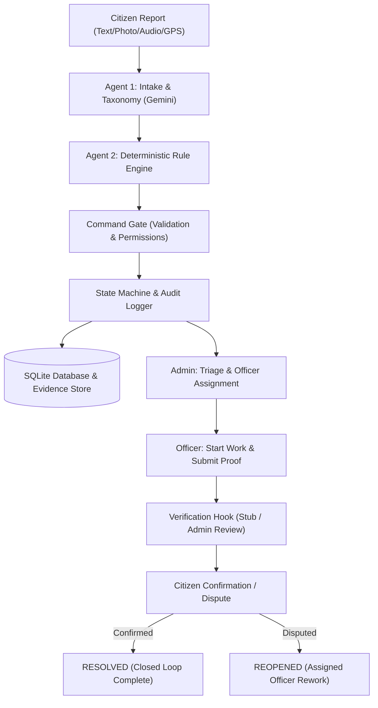
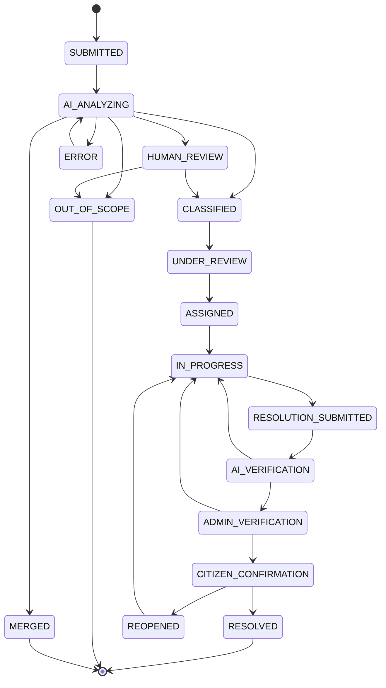

# ResolveIt

> Autonomous, closed-loop civic issue resolution platform with multimodal AI intake, deterministic municipal routing, and verified resolution closure.

| Resource | Link / Status |
|---|---|
| GitHub Repository | [akashwagh07/ResolveIt](https://github.com/akashwagh07/ResolveIt) |
| Live Demonstration | [ADD LIVE DEMO URL] |
| Video Walkthrough | [ADD DEMO VIDEO LINK] |
| Presentation Deck | [ADD PPT LINK] |

---

## The Problem and Our Answer

Most civic grievance portals fail because they operate as **open loops**: complaints vanish into unmonitored queues, status updates are fabricated without physical proof, and citizens are never asked to verify the fix.

**ResolveIt enforces an autonomous, verified closed loop:**
1. **Multimodal Intake**: Citizens report problems via text, photographs, audio voice recordings, or video with automatic GPS geotagging.
2. **AI Classification with Deterministic Governance**: Multimodal AI (Agent 1) analyzes evidence and categorizes issues, but critical governance decisions (severity scoring, priority calculation, department routing, and SLA deadlines) are executed entirely by deterministic Python rule engines—never left to LLM opinion.
3. **Command Gate & Audit Log**: Every database mutation must pass through a command gate validating caller permissions and state constraints, logging an append-only audit trail.
4. **Verified Resolution**: Field officers must upload physical "after" photos compared against original evidence. A verification protocol routes evidence through administrative review to citizen confirmation. A complaint cannot close until the fix is verified.

---

## What Works Today

| Capability | Status | Implementation Details |
|---|---|---|
| **Multimodal Intake** | **Built** | Text, photos (`.jpg`, `.png`, `.webp`), audio voice notes (`.wav`, `.mp3`), video, and GPS coordinates. |
| **Agent 1 Classification** | **Built** | Gemini multimodal classification, alias normalization, canonical 10-department taxonomy matching. |
| **Deterministic Rule Engine** | **Built** | 0–10 severity scoring, priority tiers with vulnerable area bumps, department routing, SLA deadlines. |
| **Command Gate & Audit Trail** | **Built** | 13 command schemas, 7 authorized actor roles, rejection tracking, immutable append-only event log. |
| **Human Review & Out-of-Scope** | **Built** | Low-confidence routing (< 0.60), missing info flags, admin confirmation, and formal out-of-scope rejection. |
| **Officer & Admin Workflow** | **Built** | Role-guarded work queues, SLA overdue timers, officer assignment, task lifecycle management. |
| **Resolution Evidence** | **Built** | Multi-image "after" photo uploads with side-by-side comparison against initial complaint photos. |
| **Verification Pipeline** | **Partial** | `StubVerifier` protocol hook is active (`VERIFIER=stub`) routing to human admin review; vision AI comparison is planned. |
| **Citizen Confirm or Dispute** | **Built** | Citizen one-click resolution confirmation (transitions to `RESOLVED`) or structured dispute (reopens complaint). |
| **Dashboards and Map** | **Built** | Interactive Leaflet geographic map, Kolhapur jurisdiction boundary, departmental breakdown analytics. |
| **LLM Quota & Cache** | **Built** | Fallback chain (`3.6-flash` -> `3.5-flash` -> `3.7-flash`), SHA-256 disk cache, 120s quota circuit breaker cooldown. |
| **Background Scheduler & SLA** | **Planned** | State machine supports SLA escalation and auto-closure; continuous background polling daemon is planned. |
| **Duplicate / Root-Cause Clustering** | **Planned** | `Cluster` model and `LINK_CLUSTER` schema exist; automated spatial clustering algorithms are planned. |

---

## Architecture





### Core Design Principles
- **Agents Propose, Backend Executes**: AI agents output command structures validated by the backend command gate before any database mutation.
- **Deterministic Critical Path**: Severity score, priority tier, department routing, and SLA deadlines are purely deterministic Python code—never LLM opinion.
- **AI Never Closes a Complaint**: Final closure requires explicit citizen confirmation or admin verification.
- **Confidence Gating**: High confidence (>= 0.85) auto-progresses; medium confidence (0.60–0.84) flags review; low confidence (< 0.60) routes to human intake review.
- **Immutable Audit Trail**: Every status transition and action appends an immutable record to `complaint_events`.

---

## Tech Stack

| Layer | Technologies |
|---|---|
| **Frontend** | React 18, Vite, Tailwind CSS, Lucide Icons, Leaflet / React-Leaflet, Recharts |
| **Backend API** | Python 3.11, FastAPI, Pydantic v2, SQLAlchemy 2.0, Uvicorn |
| **Database & Storage** | SQLite (WAL mode), local filesystem evidence store |
| **AI / Multimodal LLM** | Google GenAI SDK (`gemini-3.6-flash`, `gemini-3.5-flash`, `gemini-3.7-flash`), on-disk cache |
| **Testing & Tooling** | Pytest, HTTPX, PostCSS, Autoprefixer |

---

## Quick Start

### Prerequisites
- Python 3.11 or newer
- Node.js 18 or newer and npm

### 1. Backend Setup
Run in Windows PowerShell from the repository root:
```powershell
python -m venv .venv
.venv\Scripts\Activate.ps1
pip install -r requirements.txt
copy .env.example .env
```
*(On macOS/Linux: `source .venv/bin/activate` and `cp .env.example .env`)*

Configure your `.env` file:
- Set `GEMINI_API_KEY` to your Gemini API key (optional for offline testing; tests run fully mocked).
- Leave other variables at their default settings.

Start the backend server:
```powershell
uvicorn backend.app.main:app --reload --port 8000
```

### 2. Frontend Setup
In a separate terminal:
```powershell
cd frontend
copy .env.example .env
npm install
npm run dev
```
Open [http://localhost:5173](http://localhost:5173) in your browser.

### 3. Reset Demo Database
To restore the database and reseed the baseline Kolhapur demo data:
```powershell
python -m backend.scripts.reset_demo_db --yes
```

### 4. Run Tests
```powershell
pytest
```

---

## Demo Guide for Judges

### Demo Accounts & Login
The landing page includes an interactive persona selector:
- **Citizen**: Select **Citizen**, enter name (`Rahul Deshmukh`) and phone number (`+91 9822012345`). No passcode required.
- **Field Officer**: Select **Officer**, choose an account (e.g. `Vikram Jadhav` — Roads & Bridges), and enter the passcode (local default: `officer123`; deployed: `officer123`).
- **Municipal Admin**: Select **Admin**, choose an account (e.g. `Sanjay Deshmukh` — Municipal Commissioner), and enter the passcode.

### 5-Minute Closed-Loop Walkthrough
1. **Submit Issue (Citizen)**:
   - On `/`, log in as Citizen (`Rahul Deshmukh`).
   - Click **Report Civic Issue**, fill in description (`"Massive pothole near school gate on MG Road"`), click **Use My Location** (or pin on map), attach a photo, and click **Submit Complaint**.
2. **Observe AI Intake & Deterministic Scoring**:
   - The complaint dossier immediately displays Agent 1 classification (`ROADS_MAINTENANCE` / `POTHOLE`), deterministic severity score (e.g. `7.8/10`), priority (`P1`), SLA deadline, and confidence breakdown.
3. **Assign Field Officer (Admin)**:
   - Click **Switch persona** in the header, select **Admin** (`Sanjay Deshmukh`), and enter the passcode.
   - Navigate to **Work Queue** (`/admin`), find the new complaint, click **Review**, then click **Assign Officer**.
   - Select `Vikram Jadhav` (Roads department) and click **Confirm & Execute**.
4. **Execute & Upload Evidence (Officer)**:
   - Switch role to **Officer** (`Vikram Jadhav`), open **My Tasks** (`/officer`), and click **Start Work** (transitions to `IN_PROGRESS`).
   - Click **Upload Resolution Proof**. Observe the original complaint image displayed side-by-side. Enter work notes, attach an after photo, and click **Submit for Verification**.
5. **Approve Resolution (Admin)**:
   - Switch role to **Admin**. Open the complaint to view the **VerificationCard** and side-by-side **BeforeAfter** proof.
   - Click **Approve Resolution**. Status transitions to `CITIZEN_CONFIRMATION`.
6. **Confirm Closure or Dispute (Citizen)**:
   - Switch back to **Citizen**. Open the complaint under **My Complaints**.
   - **Confirm Resolution**: Click **Confirm Resolution** -> Status transitions to `RESOLVED`, completing the verified closed loop.
   - **Dispute Path**: Alternatively, click **Dispute Resolution** with a reason -> Status transitions to `REOPENED` and returns to the officer's active queue.

---

## Configuration

| Variable | Description | Safe Default |
|---|---|---|
| `GEMINI_API_KEY` | Google Gemini API key for multimodal classification | `""` |
| `GEMINI_MODEL` | Primary multimodal model | `gemini-3.6-flash` |
| `GEMINI_FALLBACK_MODELS` | Fallback models tried sequentially on failure or quota exhaustion | `gemini-3.5-flash,gemini-3.7-flash` |
| `LLM_CACHE_DIR` | Directory for SHA-256 disk cache of LLM responses | `./.llm_cache` |
| `LLM_CACHE_ENABLED` | Toggle disk caching for offline reproducibility | `true` |
| `LLM_TIMEOUT_SECONDS` | Per-request network timeout for LLM calls | `60` |
| `LLM_TOTAL_TIMEOUT_SECONDS` | Total timeout budget across all models and retries per intake | `25` |
| `LLM_QUOTA_COOLDOWN_SECONDS` | Circuit breaker duration on HTTP 429 quota exhaustion | `120` |
| `LLM_MAX_RETRIES` | Maximum retry attempts per model on transient errors | `3` |
| `TIME_SCALE` | Simulation acceleration factor for SLA virtual clock | `1.0` |
| `OFFICER_PASSCODE` | Passcode required for Officer and Admin demo login | `officer123` |
| `VERIFIER` | Verification engine (`stub` protocol or future visual AI) | `stub` |
| `DATABASE_URL` | SQLite database connection string | `sqlite:///./resolveit.db` |
| `UPLOAD_DIR` | Filesystem storage directory for complaint and evidence files | `./uploads` |
| `FRONTEND_ORIGIN` | Allowed CORS origin for frontend client | `http://localhost:5173` |
| `DEMO_MODE` | Enables seed endpoints and demo helper features | `true` |

---

## API Overview

All routes are prefix-scoped and documented via interactive Swagger UI at `http://localhost:8000/docs`.

| Method | Endpoint | Description |
|---|---|---|
| `GET` | `/api/health` | Health check returning clock status, database state, and LLM circuit breaker metrics. |
| `GET` | `/api/auth/whoami` | Resolves caller identity and permissions from `X-Demo-*` request headers. |
| `GET` | `/api/users` | Lists seeded municipal staff accounts for demo role switching. |
| `GET` | `/api/departments` | Lists all 10 canonical municipal departments and escalation hierarchy. |
| `GET` | `/api/complaints` | Lists complaints with filtering by status, category, department, officer, and review flags. |
| `POST` | `/api/complaints` | Citizen intake endpoint accepting text, coordinates, and multipart media files. |
| `GET` | `/api/complaints/{id}` | Returns full complaint dossier, resolution evidence, and before/after image URLs. |
| `GET` | `/api/complaints/{id}/events` | Returns chronological, append-only audit event log for the complaint. |
| `GET` | `/api/complaints/{id}/actions` | Lists workflow actions currently permissible for the authenticated caller. |
| `POST` | `/api/complaints/{id}/actions/{action}` | Executes a validated state machine action through the command gate. |
| `POST` | `/api/complaints/{id}/resolution` | Officer upload of completion description and after photos with verification hook. |
| `GET` | `/api/evidence/{id}/file` | Securely serves stored image, audio, or video evidence files. |

---

## Testing and Evaluation

The test suite runs 100% offline without live network dependencies or API keys. Tests run in temporary, isolated SQLite databases that are created and destroyed per test session, ensuring the real `resolveit.db` is never touched.

```powershell
pytest
```
*Current suite: 107 passed, 1 skipped (live API test enabled only with `$env:RUN_LIVE_LLM="1"`).*


---

## Limitations and What Is Simulated

- **Simulated Accounts & Headers**: Authentication uses demo headers (`X-Demo-Role`, `X-Demo-User-Id`, `X-Demo-Passcode`) and seeded municipal accounts rather than a full OAuth2/JWT directory service.
- **Verification Protocol**: The active verification engine uses `StubVerifier` (`VERIFIER=stub`), recording an `ADMIN_REVIEW` verdict so human municipal supervisors perform visual validation. Direct multimodal vision verification is planned.
- **Prototype Severity & SLA Rules**: Scoring rubrics and SLA timing windows reflect realistic municipal heuristics rather than legally binding city charters.
- **Local Storage**: Uploaded evidence files and SQLite database live on local disk; cloud storage (S3/GCS) and PostgreSQL are required for multi-instance production.
- **Quota Resilience**: In free-tier environments, Gemini quota exhaustion (HTTP 429) triggers automatic model failover and circuit breaker protection, degrading safely to human triage without crashing.

---

## Roadmap

- [ ] **Automated Background Scheduler Daemon**: Continuous background worker to automatically trigger SLA breach escalations and 72-hour citizen confirmation timeouts.
- [ ] **Spatial & Cross-Department Root-Cause Clustering**: Automated geospatial clustering to link duplicate pothole reports and flag joint utility-road failures.
- [ ] **Multimodal Vision Verification**: Automated before/after visual difference and tamper-detection scoring using Gemini Vision.
- [ ] **Open-Meteo Dynamic Priority**: Real-time rainfall and flood risk weighting wired into the priority calculation engine.
- [ ] **Citizen SMS & WhatsApp Integration**: Twilio/WhatsApp webhook adapters for feature-phone reporting without browser access.

---

## Development Process and Compliance

- **Hackathon Window**: Built entirely within the hackathon timeline.
- **AI Tooling Compliance**: AI assistants (Antigravity and Claude) were used for pair programming in compliance with hackathon guidelines; all repository commits reflect the developer who implemented and verified the code.
- **Open Source & Third-Party Attributions**:
  - Map tiles & geodata: &copy; [OpenStreetMap](https://www.openstreetmap.org/copyright) contributors
  - UI Components & Maps: [Leaflet](https://leafletjs.com/), [React-Leaflet](https://react-leaflet.js.org/), [Lucide React](https://lucide.dev/), [Recharts](https://recharts.org/), [Tailwind CSS](https://tailwindcss.com/)
  - Backend Frameworks: [FastAPI](https://fastapi.tiangolo.com/), [SQLAlchemy](https://www.sqlalchemy.org/), [Pydantic](https://docs.pydantic.dev/)
  - AI Services: [Google Gemini API](https://ai.google.dev/) via official `google-genai` SDK

---

## Repository Structure

```
ResolveIt/
├── backend/            # FastAPI service, command gate, state machine, rule engines, agents
│   ├── app/            # Application logic, models, routers, schemas, verification
│   ├── scripts/        # Database reseed and end-to-end demo lifecycle scripts
│   └── tests/          # 107 offline unit and integration tests
├── frontend/           # React 18 + Vite + Tailwind CSS web application
│   ├── src/            # Pages (Citizen, Officer, Admin), components, map, audio recorder
│   └── dist/           # Production build output
├── docs/               # Technical specifications, agent docs, manual test guides, status
└── eval/               # Evaluation benchmark dataset placeholder
```

<!-- ---

## Screenshots

Screenshots: [ADD BEFORE SUBMISSION] -->

<!--

*Citizen reporting interface with GPS location, photo preview, and classified dossier*


*Admin municipal dashboard with department triage, priority breakdown, and SLA queue*


*Geographic visualization of civic issues with status-coded markers and Kolhapur boundary*


*Detailed complaint view showing deterministic factor breakdown and append-only event trail*


*Side-by-side before and after evidence comparison for resolution verification*


*Interactive demo persona switching and simulation controls*
-->
